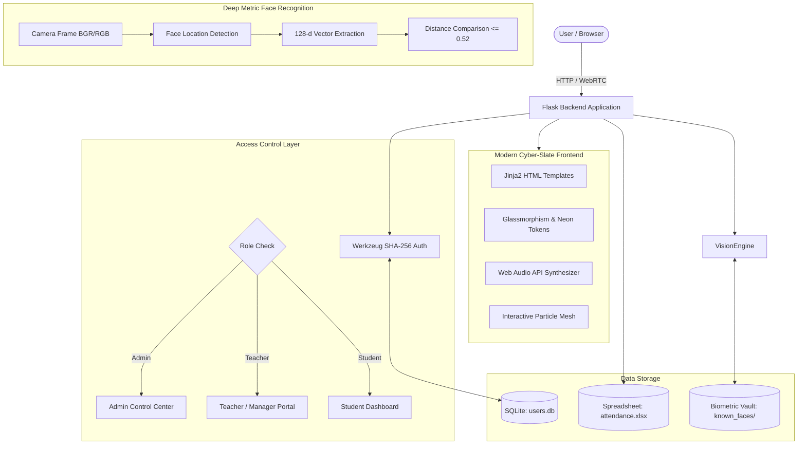

# ⚡ VisionPass AI — Biometric Face Recognition Attendance System

[](https://www.python.org/)
[](https://flask.palletsprojects.com/)
[](https://opencv.org/)
[](https://github.com/ageitgey/face_recognition)
[](https://www.sqlite.org/)
[](https://openpyxl.readthedocs.io/)

**VisionPass AI** is an automated, contactless biometric attendance management system built with Flask, OpenCV, and deep metric facial recognition. It provides high-accuracy biometric authentication, in-browser webcam scanning with a high-tech HUD, native Web Audio feedback, automatic Excel synchronization, and complete **Role-Based Access Control (RBAC)** across Administrators, Faculty/Managers, and Students/Employees.

---

## 👥 Authors & Team Contributions

This project was collaboratively engineered and developed by:

### 🌟 Subodh Uttam Muneshwar ([@SubodhMuneshwar](https://github.com/SubodhMuneshwar))
* **Frontend Engineering & UI/UX Architecture**:
  * Designed the modern cyber-slate glassmorphic design system with Google Fonts (*Outfit* + *Plus Jakarta Sans*).
  * Built the interactive background particle mesh (`particles.js`) and client-side Web Audio API synthesizer (`sound.js`) for audio feedback.
* **Frontend-to-Backend Integration**:
  * Engineered the dual-mode webcam pipeline (client-side HTML5 WebRTC canvas capture streaming base64 frames to Flask REST endpoints).
  * Implemented client-side biometric validation rules, live countdown camera snapshot on registration, and password strength evaluation.
* **Multi-Role RBAC Dashboards**:
  * Designed and integrated the **Master Admin Console** (user CRUD, role management, face vault, log curation) and the **Teacher/Manager Supervisory Portal** (manual overrides, class analytics, and live search).

---

### 🌟 Nihar Narvekar ([@Nihar0001](https://github.com/Nihar0001))
* **Machine Learning & Computer Vision Pipeline**:
  * Implemented the deep metric facial recognition pipeline utilizing dlib's 128-dimensional facial embedding vectors.
  * Conducted model benchmarking, tolerance threshold calibration, and validation against varied lighting conditions.
* **Backend Architecture & Attendance Engine**:
  * Structured the core Flask backend routing, camera hardware frame capture via OpenCV, and color space conversions.
  * Developed the SQLite database models (`User` with Werkzeug SHA-256 password hashing) and the automated Excel spreadsheet logging engine via `OpenPyXL`.

---

## 🚀 Key Features

### 1. 🎯 Precision Biometric Recognition
* **128-Dimensional Embeddings**: Extracts facial landmarks and maps facial geometry into a 128-d vector space via deep convolutional neural networks.
* **Euclidean Distance Comparison**: Evaluates Euclidean distances with a strict `<0.52` matching tolerance to ensure secure identity verification and eliminate false positives.

### 2. 📸 High-Tech Biometric Scanner HUD
* **In-Browser WebRTC Capture**: Streams video directly in the user's browser, eliminating server hardware lockups and cross-network latency.
* **Sci-Fi HUD Overlays**: Features animated corner brackets, sweeping laser beams, live telemetry diagnostics, and optical shutter flashes.
* **Multi-Camera Switcher**: Automatically enumerates connected video devices allowing users to switch between front, rear, or external webcams.
* **Server-Side Fallback**: Preserved OpenCV camera hardware capture with 5-frame auto-exposure stabilization.

### 3. 🛡️ Role-Based Access Control (RBAC)
* **Master Administrator Console (`/admin/dashboard`)**:
  * Complete user management (create users, assign/switch roles, delete accounts).
  * Spreadsheet curation: audit and delete individual rows in `attendance.xlsx`, or clear logs with confirmation.
  * Biometric Face Vault: visual gallery of all enrolled reference photos in `known_faces/` with one-click deletion and memory invalidation.
* **Teacher / Professor / Manager Portal (`/teacher/dashboard`)**:
  * Live organization-wide attendance audit stream.
  * Real-time attendance rate analytics and present headcount.
  * Manual override modal to record attendance for remote or excused students.
  * Direct Excel download export.
* **Student / Employee Portal (`/dashboard`)**:
  * Personal check-in history table.
  * Real-time biometric status indicator.
  * Quick launcher for biometric attendance.

### 4. 🧬 Dual Face Enrollment with Mandatory Validation
* **Live Camera Snapshot**: Built-in webcam viewport with an automated 3-2-1 countdown timer and shutter sound.
* **Drag-and-Drop Upload**: Dropzone with instantaneous thumbnail generation.
* **Strict Biometric Enforcement**: Registrations are rejected if no clear human face is detected in the capture, ensuring database integrity.

### 5. 📊 Automatic Excel Logging
* Attendance records are logged in real-time to [attendance.xlsx](file:///c:/Users/DELL/Desktop/Face_recognition/attendance.xlsx) with timestamps (`Name`, `Date`, `Time`).

---

## 🏗️ System Architecture



---

## 🔑 Pre-Configured Test Credentials

For quick evaluation, the application auto-seeds standard demonstration accounts upon first run:

| Role | Username | Password | Default Portal |
| :--- | :--- | :--- | :--- |
| ⚡ **Master Admin** | `admin` | `admin123` | `/admin/dashboard` |
| 🎓 **Teacher / Manager** | `teacher` | `teacher123` | `/teacher/dashboard` |
| 🎒 **Student / Employee** | `student` | `student123` | `/dashboard` |
| 👤 **Face-Enrolled Student** | `nihar` | `nihar123` | `/dashboard` |

*(The login screen includes **1-Click Auto-Fill** buttons for each role).*

---

## 📦 Installation & Setup Guide

### 1. Prerequisites
* **Python 3.10+** (Fully verified up to Python 3.14 on Windows)
* **C++ Build Tools & CMake** (required for `dlib` compilation on Windows)
* A functional **Webcam** (USB external or integrated laptop camera)

### 2. Clone the Repository
```bash
git clone https://github.com/SubodhMuneshwar/Face_recognition.git
cd Face_recognition
```

### 3. Create a Virtual Environment (Optional but Recommended)
```bash
python -m venv venv
# Windows:
venv\Scripts\activate
# Linux / macOS:
source venv/bin/activate
```

### 4. Install Dependencies
```bash
pip install -r requirements.txt
```
> [!TIP]
> If compiling `dlib` on Windows, ensure **Visual Studio C++ Build Tools** and **CMake** are installed on your machine (`pip install cmake`).

### 5. Launch the Server
```bash
python app.py
```

### 6. Access the Application
Open your browser and navigate to:
```
http://127.0.0.1:5000
```

---

## 📁 Directory Structure

```
Face_recognition/
├── known_faces/               # Enrolled biometric face portraits
│   └── nihar.jpg              # Reference face portrait for "nihar"
├── static/
│   ├── css/
│   │   └── style.css          # Cyberpunk glassmorphic design system
│   └── js/
│       ├── particles.js       # Dynamic mouse-reactive background canvas
│       └── sound.js           # Web Audio API futuristic sound effects
├── templates/
│   ├── admin_dashboard.html   # Master Admin control center
│   ├── teacher_dashboard.html # Teacher/Manager supervision portal
│   ├── dashboard.html         # Student/Employee attendance dashboard
│   ├── index.html             # Futuristic landing page & telemetry
│   ├── login.html             # Multi-role authentication & password toggle
│   ├── mark_attendance.html   # Sci-Fi biometric camera scanner HUD
│   └── register.html          # Dual-mode face enrollment (Webcam/Upload)
├── instance/
│   └── users.db               # SQLite database (auto-created)
├── app.py                     # Flask application, ML pipeline & RBAC logic
├── attendance.xlsx            # Real-time Excel attendance logs
├── requirements.txt           # Python dependency specification
├── .gitignore                 # Excludes local databases, pycache, and temp files
└── README.md                  # Project documentation & team attribution
```

---

## 🛡️ License

This project is open source and available under the [MIT License](LICENSE).
